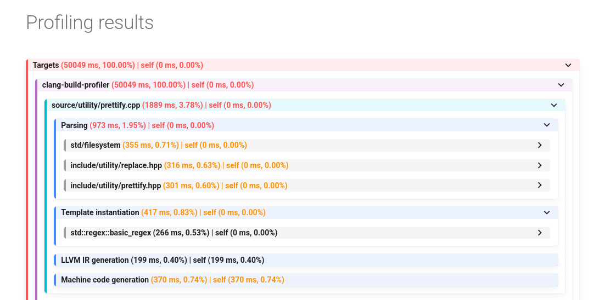

# Getting started

## Installation

Pre-compiled binaries can be found in [Releases](https://github.com/DmitriBogdanov/clang-build-profiler/releases) for following platforms:

- Windows x86-64
- Ubuntu x86-64
- MacOS x86-64
- FreeBSD x86-64

For platforms outside of the supported list, the build can be produced locally, see the [corresponding guide](building_locally.md).

In all cases, `clang-build-compiler` is a stand-alone executable with no additional dependencies.

For additional convenience it is advised to add `clang-build-compiler` to the `PATH`.

## Usage

### Basics

Compile your project using `clang++` with `-ftime-trace` flag enabled. The compiler will place JSON traces together with the object files.

To analyze a specific trace (which corresponds to a single translation unit) and output results to the terminal run:

```sh
clang-build-profiler --file=<path_to_json_trace>
```

To analyze all traces in a directory run:

```sh
clang-build-profiler --target=<path_to_directory>
```

To analyze an entire CMake build run:

```sh
clang-build-profiler --build=<path_to_cmake_build>
```

Output example:


> [!Tip]
> When invoked with no arguments, `clang-build-profiler` assumes `--build=build/` by default.

### Making the output pretty

Analyzing a large build directly in the terminal is rather impractical. Using `mkdocs` we can build a proper GUI with expandable sections.

`mkdocs` can be easily installed with `pip`:

```sh
pip install mkdocs-material          &&
pip install mkdocs-material[imaging] &&
pip install markdown-callouts        &&
pip install mkdocs-awesome-nav
```

After this we can analyze the build:

```sh
clang-build-profiler --output=mkdocs
```

And visualize it in the browser using `mkdocs`:

```sh
(cd .cbp && mkdocs serve --open)
```

Output example:



> [!Tip]
> `pip` together with `python3` can be installed using `apt` or grabbed directly from the [official website](https://www.python.org/downloads/):
>
> ```sh
> sudo apt update &&
> sudo apt install python3
> ```

### Configuration file

Following the convention of other LLVM tools, `clang-build-profiler` uses a YAML config `.clang-build-profiler` placed into the project root.

This config contains project-specific settings such as coloring, name simplification rules and etc.

For more details, see the [corresponding guide](configuration_file.md)
